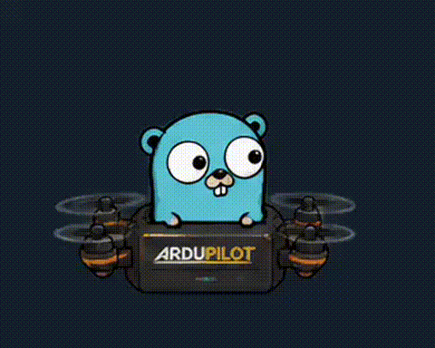

# go-dataflash

<p align="center"></p>

ArduPilot DataFlash log parser written in Go.

## About

go-dataflash is a parser for ArduPilot DataFlash binary logs (`.bin` files). It reads flight telemetry data from ArduPilot-based flight controllers.

## Version History

### v3.0.0
- **~5x faster, ~9x less memory** reading a log without decoding every field — the gap grows on bigger logs (see [Super fast](#super-fast))
- **Lazy field decoding**: `Message.Fields` is now a method, `Message.Fields()`; new `Message.Get(field)` decodes a single field without building a map (see [Reading Fields](#reading-fields))
- New `Parser.Messages()` iterator: `for msg, err := range parser.Messages() { ... }`
- New `Parser.ReadInto(msg)` to reuse a message across reads with no per-message allocation (see [Reusing Messages](#reusing-messages))
- `Parser.Close` removed — it did nothing since v2
- Module path updated to `/v3`
- Plus: `Parser.Stats()` for damaged-log diagnostics, `Message.HasTimeUS`, an atomic `SetFilter`, and several panic/hang fixes on corrupt logs

Full changes: see the [v3.0.0 release notes](https://github.com/pryamcem/go-dataflash/releases/tag/v3.0.0).

Migrating from v2: `msg.Fields["X"]` → `msg.Fields()["X"]` (or `msg.Get("X")` for one field); drop any `parser.Close()` calls.

### v2.1.0
- Fixed a desync where a known message body containing the `0xA3 0x95` magic bytes could be mistaken for the next header, silently dropping later FMT records (by Arjun Akkiraju, [#9](https://github.com/pryamcem/go-dataflash/pull/9))

### v2.0.0
- Caller now owns the source — `NewParser` accepts `io.ReadSeeker`, `Close` is a no-op
- `ClearFilter` removed — use `SetFilter()` with no arguments instead
- `SliceType` changed from string to `int` enum for compile-time safety
- `GetScaled` now returns `ScaledValue` instead of `(any, string, error)`
- `GetSchemas` returns a copy to prevent external mutation
- Module path updated to `/v2`

### v1.3.0
- `NewParserFromSource` — parse from any `io.ReadSeeker`, not just files (by [@yur4uwe](https://github.com/yur4uwe))

### v1.2.0
- Performance improvements (~15-40 times faster with bufio)

### v1.1.0
- Message tracking (LineNo, TimeUS)
- Log slicing by line number or time
- Units and multipliers support (FMTU)

### v1.0.0
- Two-pass parsing architecture
- FMT (format) message parsing
- Message schema discovery
- Data message parsing
- Message filtering

## Usage



See [examples/parse_log](https://github.com/pryamcem/go-dataflash/tree/master/examples/parse_log) for a complete working example.

### Basic Usage

```go
import "github.com/pryamcem/go-dataflash/v3"

f, err := os.Open("log.bin")
if err != nil {
    log.Fatal(err)
}
defer f.Close()

parser, err := dataflash.NewParser(f)
if err != nil {
    log.Fatal(err)
}

for msg, err := range parser.Messages() {
    if err != nil {
        log.Fatal(err)
    }
    // Process msg.Name, msg.TimeUS, and fields (see "Reading Fields")
}
```

The loop ends at the end of the log. A log cut off in the middle of a message (common after a crash) also ends normally; check `parser.Stats().Truncated` if you need to know. `Messages` does not rewind, so call `parser.Rewind()` to loop again. If you prefer a plain loop, `ReadMessage` returns `io.EOF` at the end.

### Reading Fields

Messages are decoded lazily: `ReadMessage` keeps the raw bytes and only decodes a field when you ask for it.

```go
// One or a few fields: decodes just that field
alt, ok := msg.Get("Alt")  // ok is false if the field does not exist

// Many fields: decodes all of them once and caches the result
for name, value := range msg.Fields() {
    fmt.Println(name, value)
}
```

If you need most of a message's fields, call `Fields()` once instead of calling `Get` for every column. `Get` per column is slower than `Fields()`.

### Reusing Messages

`ReadInto` fills a `Message` you provide and reuses its buffer, so reading does not allocate per message:

```go
var msg dataflash.Message
for {
    err := parser.ReadInto(&msg)
    if err == io.EOF {
        break
    }
    if err != nil {
        log.Fatal(err)
    }
    // msg is only valid until the next ReadInto call
    if alt, ok := msg.Get("Alt"); ok {
        altitudes = append(altitudes, alt)  // decoded values are independent copies, safe to keep
    }
}
```

The message data is overwritten on the next call. Copy out anything you need to keep. Use `ReadMessage` if you want messages you can hold on to.

### Filtering Messages

```go
parser.SetFilter("GPS", "IMU")  // Only parse GPS and IMU messages

for msg, err := range parser.Messages() {
    if err != nil {
        log.Fatal(err)
    }
    // msg.Name will be either "GPS" or "IMU"
}

parser.SetFilter()  // Clear filter, all message types returned
```

### Units and Scaled Values

Fields are automatically scaled based on their format character and FMTU multipliers:

```go
msg, _ := parser.ReadMessage()

// Format characters like 'c', 'e', 'L' include built-in scaling when decoded.
// FMTU multipliers (e.g., for 'Q', 'I') are applied by GetScaled.
rawTimeUS, _ := msg.Get("TimeUS")  // uint64 value

// Get scaled value with unit
sv, _ := msg.GetScaled("TimeUS")  // sv.Value = float64(44.167), sv.Unit = "s"
sv, _ = msg.GetScaled("Alt")      // sv.Value = float64(275.3),  sv.Unit = "m"
sv, _ = msg.GetScaled("Status")   // sv.Value = uint8(3),        sv.Unit = ""

// Get all fields with units (types preserved when no scaling needed)
scaledFields := msg.GetScaledFields()
for name, sv := range scaledFields {
    if sv.Unit != "" {
        fmt.Printf("%s: %v %s\n", name, sv.Value, sv.Unit)
    }
}
```

## Super fast
Fields are decoded lazily (see [Reading Fields](#reading-fields)), so parsing a log without touching every field is very fast, and the gap over v2 grows with log size. On a real-world ~184MB log (not included in this repo):

```
goos: linux
goarch: amd64
pkg: github.com/pryamcem/go-dataflash/v3
cpu: 11th Gen Intel(R) Core(TM) i7-1185G7 @ 3.00GHz
BenchmarkParseAllMessages-8   	       2	 645849630 ns/op	614664156 B/op	 8495444 allocs/op
BenchmarkParseFiltered-8      	       3	 422928546 ns/op	 5114328 B/op	   80642 allocs/op
BenchmarkParseReadInto-8      	       3	 436746922 ns/op	  337408 B/op	   14294 allocs/op
PASS
```

That's ~7.6x faster and ~10x less memory than v2 reading every message without decoding fields (averaged over several runs); filtered reads cut allocations ~7.9x and memory ~16x (wall-clock time there was already short-circuited in v2's filter path, so the gap is smaller, ~1.1x); `ReadInto` keeps allocations close to zero (a few hundred KB total) no matter the log size.

You can reproduce a smaller version of this on the public `testdata/testlog.bin` (5.9MB, 128,443 messages) included in this repo:

```
DATAFLASH_BENCH_FILE=testdata/testlog.bin go test -bench . -benchmem
```
```
BenchmarkParseAllMessages-8   	      57	  19801442 ns/op	19287948 B/op	  270018 allocs/op
BenchmarkParseFiltered-8      	      73	  15741445 ns/op	 4587527 B/op	   66551 allocs/op
BenchmarkParseReadInto-8      	      86	  13544282 ns/op	  321196 B/op	   13133 allocs/op
PASS
```

[See benchmark](https://github.com/pryamcem/go-dataflash/tree/master/benchmark_test.go) and try it on your own logs with `DATAFLASH_BENCH_FILE=<path>`.

## DataFlash Format Overview

### Structure
- Each message starts with a 3-byte header: `0xA3`, `0x95`, `msgType`
- First messages are FMT (Format) messages (type 128) that define all other message types
- Data messages follow, using the formats defined by FMT messages

### FMT Message Structure
- Type: uint8 (the message type this format describes)
- Length: uint8 (total message length including 3-byte header)
- Name: 4-char string (message name, e.g., "GPS", "IMU")
- Format: 16-char string (format specifiers: `B`=uint8, `h`=int16, `H`=uint16, `i`=int32, `I`=uint32, `f`=float, `d`=double, `n`=char[4], `N`=char[16], `Z`=char[64], `c`=int16*100, `C`=uint16*100, etc.)
- Columns: 64-char string (comma-separated column names)

### Key Implementation Notes
1. Build a map of `msgType -> FMT` as you read FMT messages
2. All strings are null-terminated but have fixed max lengths
3. Binary encoding is little-endian
4. The format string tells how to decode each field in order

## Learning Goals

This project was created to:
- Remember Go
- Understand binary file formats
- Practice parsing techniques
- Explore ArduPilot telemetry data

## References

- [ArduPilot DataFlash Log Format](https://ardupilot.org/dev/docs/loganalysis.html)
- [pymavlink](https://github.com/ArduPilot/pymavlink) - Python reference implementation
